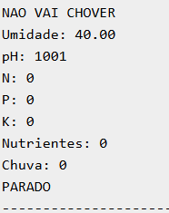
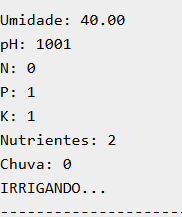

# Sistema de Irrigação Inteligente - FarmTech Solutions

## Introdução

Este projeto foi desenvolvido no contexto da FarmTech Solutions, com foco em Agricultura Digital. O objetivo foi simular um sistema inteligente capaz de tomar decisões automáticas de irrigação com base em dados do ambiente.

## Objetivo

Criar um sistema que monitora:
- Umidade do solo
- Nutrientes 
- pH da terra
- Previsão de chuva 

## Cultura escolhida

- Tomate
- Alface

## Componentes

- ESP32
- Botões (NPK)
- LDR (pH)
- DHT22 (umidade)
- Relé (bomba)

## Funcionamento

O sistema lê sensores continuamente e decide se deve irrigar ou não.

## Lógica

A irrigação ocorre quando:

- Umidade < 40
- Nutrientes >= 2
- pH entre 300 e 800
- Não houver previsão de chuva

## Integração (Opcional 1)

Foi utilizado Python com API de clima.

O resultado é enviado ao ESP32 via Serial Monitor:
- 1 = vai chover
- 0 = não vai chover

## Análise de Dados (Opcional 2)

Foi utilizada linguagem R para análise de média de umidade, auxiliando na tomada de decisão.

## Imagens

### Circuito

### Sistema parado

### Sistema irrigando

## Vídeo

[https://www.youtube.com/watch?v=Z8tuvOLXVZE](https://www.youtube.com/watch?v=Z8tuvOLXVZE)

## Conclusão

O projeto demonstrou a aplicação de IoT na agricultura, integrando sensores, lógica de decisão e dados externos para otimizar o uso de água.

## Autor

João Victor do Nascimento Gonçalves
FIAP - Inteligência Artificial
